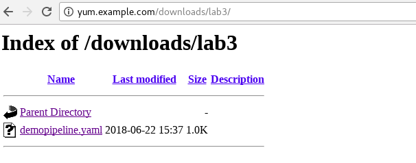
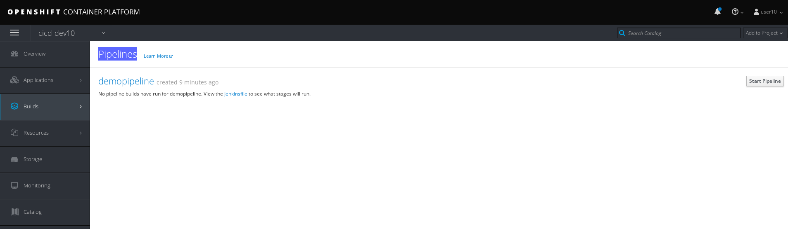
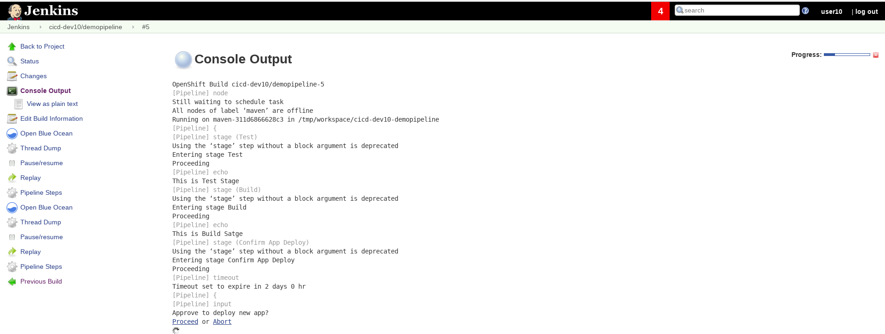

= DevOps
:toc: manual

== 环境准备

点击 http://yum.example.com/downloads/lab3/ 下载

 

== 通过命令行创建一个工程

[source, bash]
-----
$ oc login https://master.example.com:8443 -u userXX -p redhat
$ oc new-project cicd-devXX
-----

== 创建CICD 构建创始模型

登录 Web console（https://master.example.com:8443）界面，在工程列表中点击 `cicd-devXX` 进入初始界面，点击 `Import YAML/JSON` 按钮，进入 DevOps CICD 构建初始模型创建界面

image:img/ocp-cicd-import-jenkeins.png[]

点击 Browser, 选择 `demopipeline.yaml`, 导入。

点击 `Create` 开始创建。等待 1 - 2 分钟后部署成功，查看路由信息：

[source, bash]
----
$ oc get routes
NAME      HOST/PORT                             PATH      SERVICES   PORT      TERMINATION     WILDCARD
jenkins   jenkins-cicd-devXX.apps.example.com             jenkins    <all>     edge/Redirect   None
----

== CICD 初始模型测试

在 Web Console 上选择 `Buils` -> `Pipelines`，进入到 Pipelines 列表，

点击右上角 `Start Pipleline` 按钮开始一次构建，构建的过程中点击 `View Log`, 重定向到 https://jenkins-cicd-devXX.apps.example.com/ 进入 jenkins-cicd 界面

image:img/ocp-cicd-jenkens-sso.png[]

点击 `Login with Openshift` 使用 OpenShift 登录用户/密码登录, jenkins 构建日志界面如下：

在 OpenShift Web Console 界面点击 `Confim App Deploy`

image:img/ocp-cicd-approval.png[]

点击 Process 进行 Deploy

image:img/ocp-cicd-approval-process.png[]

CICD 一次成功构建界面

image:img/ocp-cicd-demo-success.png[]

== 添加 PHP 项目构建

在 Web Console 上选择 `Buils` -> `Pipelines` -> `Action` -> `Edit`，在 Build Stage 添加

[source, bash]
-----
sh "oc new-app php:7.0~http://git.example.com/open-source/php-helloworld.git --name=php-helloworld"
sh "oc expose svc/php-helloworld"
-----

image:img/ocp-cicd-deploy-php.png[]

保存后再次触发 Pipeline，构建完成后可以通过 http://php-helloworld-cicd-devXX.apps.example.com/ 访问 PHP 页面

image:img/ocp-cicd-php-view.png[]

== 自动触发 CICD 构建

[source, bash]
-----
$ curl -k -X POST https://master.example.com:8443/oapi/v1/namespaces/cicd-dev10/buildconfigs/demopipeline/webhooks/secret101/generic
-----

如上命令会自动触发一个构建。
