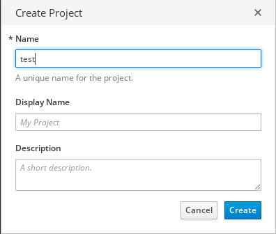
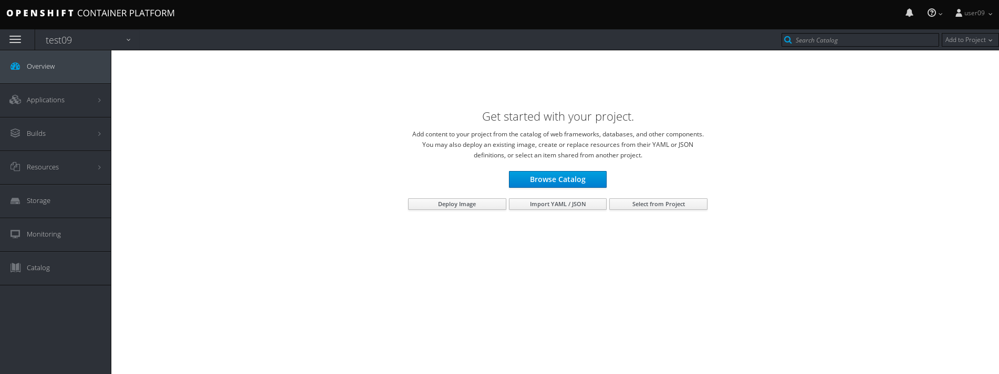
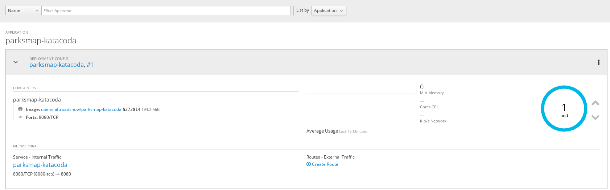
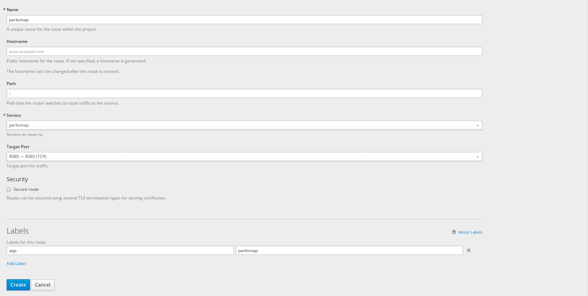
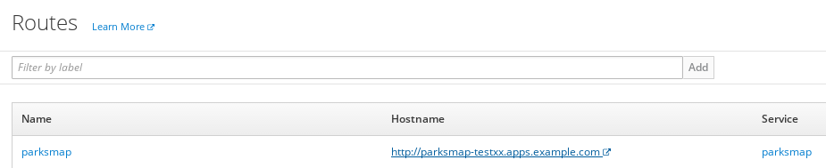
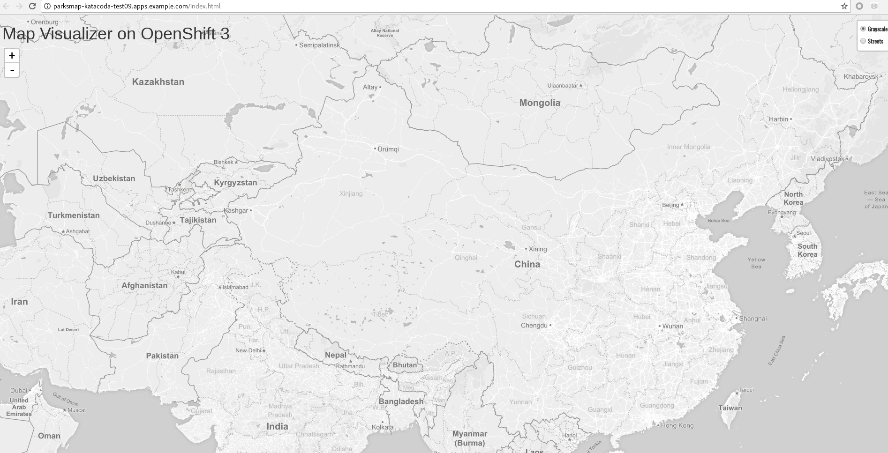
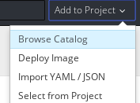
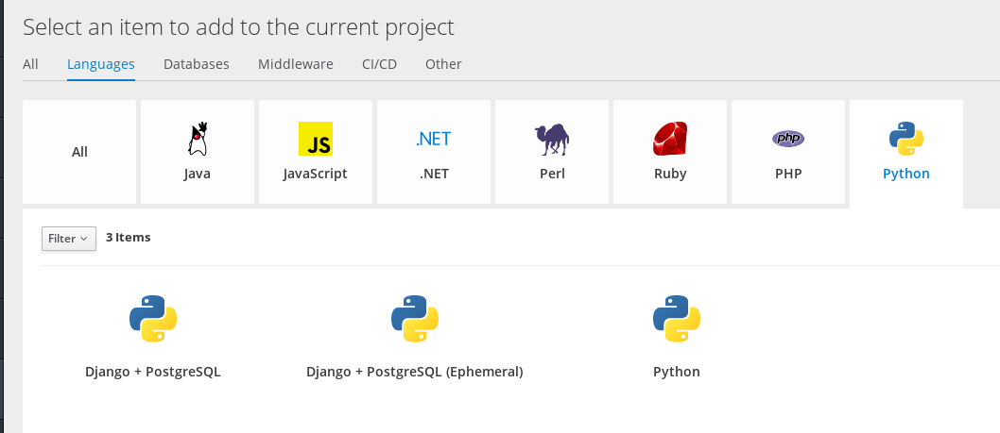
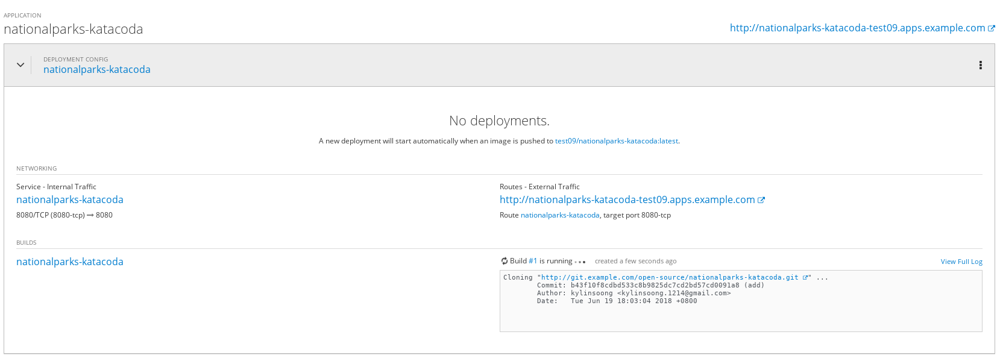

= 快速开始
:toc: manual

== 命令行

[source, bash]
.*1 - 命令行登录*
----
$ oc login https://master.example.com:8443
Authentication required for https://master.example.com:8443 (openshift)
Username: userXX
Password: 
Login successful.

You don't have any projects. You can try to create a new project, by running

    oc new-project <projectname>

----

[source, bash]
.*2 - 登录验证*
----
$ oc whoami
userXX
----

== Web Console

浏览器中输入 https://master.example.com:8443 进入 OpenShift 容器云平台登录页面

image:img/ocp-login.png[]

在上面登录页面输入

* Username - *userXX*
* Password - *redhat*

点击 `logIn`，进入 Web Console 欢迎界面。在页面的右上角你会发现 `Create Project` 按钮，点击创建 Project

在创建 project 的界面输入：

* Name - `testXX`
* Display Name - 任意名称
* Description - 任意描绘苏

点击 `Create` 按钮创建 project。

== 部署一个 Docker Image

点击 `Docker Image` 按钮，选择 Image Name，并且输入

    registry.example.com/openshiftroadshow/parksmap-katacoda:1.0.0

按 Enter 键，

image:img/ocp-deploy-image-parkmap.png[]

使用默认配置，点击 `Deploy` 按钮进行部署。

== 应用扩展

点击向上按钮扩展 parksmap Pod 的数量为 2，点击 Applications -> Pods，可以看到有两个运行的 Pods:

image:img/ocp-parkmap-pod-scale-up.png[]

点击进入任意一个 Pod, 在右上角点击 Action 下拉菜单，会看到有 Delete 选项：

image:img/ocp-pod-actions-delete.png[]

点击 `Delete` 删除 Pod, 返回到 Pod 列表，可以看到有一个新的 Pod 正在创建

image:img/ocp-pod-delete.png[]
 
选择 Overview, 点击 Pod 旁边向下箭头，将 Pod 数量降低为 1

image:img/ocp-pod-scale-down.png[]

== 给 HTTP 请求配置路由

选择 Overview, 点击 Pod，在 `NETWORKING` 栏点击 `Create Route`，

 

点击 Create 按钮创建路由。选择 Applications -> Routes 可以查看

点击上面步骤中 URL（http://parksmap-katacoda-test09.apps.example.com/）访问

== S2I 构建

应用代码路径： http://git.example.com/open-source/nationalparks-katacoda.git

在 project 右上角，Add to Project

选择 `Languages` -> `Python` -> `Python`

 

在弹出的对话框中点击 Next，在 Configuration 栏编辑:

* Version - 3.5
* Application Name - nationalparks-katacoda
* Git Repository - http://git.example.com/open-source/nationalparks-katacoda.git

image:img/ocp-catalog-config.png[]

点击 Create 完成创建。选择 Overview, 展开 nationalparks-katacoda，查看 S2I 构建的过程：

