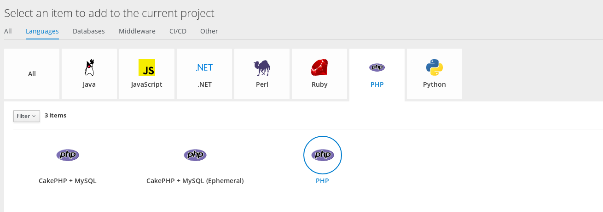
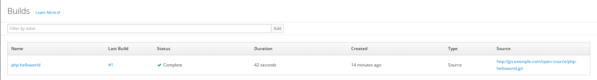

= 快速开始
:toc: manual

== 实验目的

本实验通过两个项目演示 OpenShift 基本概念，具体

* 通过 `parksmap` 演示从镜像部署、容器扩展、容器自我治愈、服务、路由  
* 通过 `php-helloworld` 演示 S2I

== 登录管理命令行

[source, bash]
.*1 - 命令行登录*
----
$ oc login https://master.example.com:8443
Authentication required for https://master.example.com:8443 (openshift)
Username: userxx
Password: 
Login successful.

You don't have any projects. You can try to create a new project, by running

    oc new-project <projectname>

----

[source, bash]
.*2 - 登录验证*
----
$ oc whoami
userxx
----

== 登录管理 Web Console

浏览器中输入 https://master.example.com:8443 进入 OpenShift 容器云平台登录页面

image:img/ocp-login.png[]

在上面登录页面输入

* Username - *userxx*
* Password - *redhat*

点击 `logIn`，进入 Web Console 欢迎界面。在页面的右上角你会发现 `Create Project` 按钮，点击创建 Project

image:img/ocp-create-project.png[]

在创建 project 的界面输入：

* Name - `testxx`
* Display Name - 任意名称
* Description - 任意描绘苏

点击 `Create` 按钮创建 project。

image:img/ocp-project-created.png[]

== 部署一个 Docker Image

点击 `Docker Image` 按钮，选择 Image Name，并且输入

    registry.example.com/openshiftroadshow/parksmap:1.2.0

按 Enter 键，

image:img/ocp-deploy-image-parkmap.png[]

使用默认配置，点击 `Deploy` 按钮进行部署。

image:img/ocp-created-parkmap.png[]

== 应用扩展与自我治愈

点击向上按钮扩展 parksmap Pod 的数量为 2，点击 Applications -> Pods，可以看到有两个运行的 Pods:

image:img/ocp-parkmap-pod-scale-up.png[]

点击进入任意一个 Pod, 在右上角点击 Action 下拉菜单，会看到有 Delete 选项：

image:img/ocp-pod-actions-delete.png[]

点击 `Delete` 删除 Pod, 返回到 Pod 列表，可以看到有一个新的 Pod 正在创建

image:img/ocp-pod-delete.png[]
 
选择 Overview, 点击 Pod 旁边向下箭头，将 Pod 数量降低为 1

image:img/ocp-pod-scale-down.png[]

== 给 HTTP 请求配置路由

选择 Overview, 点击 Pod，在 `NETWORKING` 栏点击 `Create Route`，

image:img/ocp-route-create.png[] 

点击 Create 按钮创建路由。选择 Applications -> Routes 可以查看

image:img/ocp-routes-view.png[]

点击上面步骤中 URL（http://parksmap-testxx.apps.example.com）访问

image:img/ocp-parkmap-web.png[]

== S2I

NOTE: 什么是 S2I？S2I 是指将代码快速转化成容器镜像的技术，是 OpenShift 技术的亮点，S2I 给开发者带来的好处是让开放者只关注开发本身，详细参照 https://github.com/openshift/source-to-image[S2I]

本部分所需要的代码路径： 

    http://git.example.com/open-source/php-helloworld.git

在 project 右上角，Add to Project

image:img/ocp-addproject-catalog.png[]

选择 `Languages` -> `PHP` -> `PHP`

 

在弹出的对话框中点击 Next，在 Configuration 栏编辑:

* Version - 7.0
* Application Name - php-helloworld
* Git Repository - http://git.example.com/open-source/php-helloworld.git

image:img/ocp-catalog-config.png[]

点击 Create 完成创建。选择 Overview, 展开 nationalparks-katacoda，查看 S2I 构建的过程：

image:img/ocp-s2i-build.png[]

== 构建组件 BuildConfig

* *登录 Web Console，选择 Builds -> Builds，进入构建列表：*

NOTE: *为什么部署了两个项目（parksmap 和 php-helloworld），而构建列表只有一个？*

* *点击 php-helloworld，进入构建配置界面*

image:img/ocp-bc-config-pages.png[]

点击 View Log 链接查看构建日志:

[source, bash]
----
loning "http://git.example.com/open-source/php-helloworld.git " ...
	Commit:	3514b0496f9489012006459ad02a963e375615e8 (Update index.php)
	Author:	Administrator <admin@example.com>
	Date:	Fri Jun 22 06:14:11 2018 -0400
---> Installing application source...
=> sourcing 20-copy-config.sh ...
---> 05:23:53     Processing additional arbitrary httpd configuration provided by s2i ...
=> sourcing 00-documentroot.conf ...
=> sourcing 50-mpm-tuning.conf ...
=> sourcing 40-ssl-certs.sh ...

Pushing image docker-registry.default.svc:5000/testxx/php-helloworld:latest ...
Pushed 1/6 layers, 17% complete
Pushed 2/6 layers, 35% complete
Pushed 3/6 layers, 56% complete
Pushed 4/6 layers, 78% complete
Pushed 5/6 layers, 100% complete
Pushed 6/6 layers, 100% complete
Push successful
----

点击其它页面，`Configuration`，`Environment`，`Events`，查看相关的配置。点击右上方 `Start Build` 按钮开始一次新的构建。

[source, bash]
.*命令行查看所有构建*
----
$ oc get bc
NAME             TYPE      FROM         LATEST
php-helloworld   Source    Git@master   2
----

[source, bash]
.*命令行查看构建明细*
----
$ oc describe buildconfigs/php-helloworld
Name:		php-helloworld
Namespace:	testxx
Created:	43 minutes ago
Labels:		app=php-helloworld
Annotations:	openshift.io/generated-by=OpenShiftWebConsole
Latest Version:	2

Strategy:	Source
URL:		http://git.example.com/open-source/php-helloworld.git
Ref:		master
From Image:	ImageStreamTag openshift/php:7.0
Output to:	ImageStreamTag php-helloworld:latest

Build Run Policy:	Serial
Triggered by:		ImageChange, Config
Webhook GitHub:
	URL:	https://master.example.com:8443/apis/build.openshift.io/v1/namespaces/testxx/buildconfigs/php-helloworld/webhooks/<secret>/github
Webhook Generic:
	URL:		https://master.example.com:8443/apis/build.openshift.io/v1/namespaces/testxx/buildconfigs/php-helloworld/webhooks/<secret>/generic
	AllowEnv:	false

Build			Status		Duration	Creation Time
php-helloworld-2 	complete 	7s 		2018-06-25 13:52:09 +0800 CST
php-helloworld-1 	complete 	42s 		2018-06-25 13:23:44 +0800 CST

Events:	<none>
----

[source, bash]
.*命令行开始一次新的构建*
----
$ oc start-build php-helloworld
build "php-helloworld-3" started
----

[source, bash]
.*命令行查看 Build*
----
$ oc get build
NAME               TYPE      FROM          STATUS     STARTED             DURATION
php-helloworld-1   Source    Git@3514b04   Complete   About an hour ago   42s
php-helloworld-2   Source    Git@e898342   Complete   26 minutes ago      7s
php-helloworld-3   Source    Git@e898342   Complete   9 minutes ago       20s
----

NOTE: *OpenShift 构建的过程是什么？每一次构建都是从源代码开始吗？`build` 和 `buildconfig` 的关系是什么，Openshift 构建引入 BuildConfig 带来了那些好处？*

== 部署组件 DeploymentConfig

*在 Web Console 界面，选择 Applications → Deployments，进入部署列表，选择 php-helloworld，进入部署配置页面*

image:img/ocp-deployments-condig.png[]

*点击 Configuration, Environment, Events 等页面查看部署相关配置。*

[source, bash]
.*命令行查看构建*
----
$ oc get deploymentconfigs
NAME             REVISION   DESIRED   CURRENT   TRIGGERED BY
parksmap         1          1         1         config,image(parksmap:1.2.0)
php-helloworld   3          1         1         config,image(php-helloworld:latest)
----

[source, bash]
.*命令行产看 ReplicationController*
----
$ oc get rc
NAME               DESIRED   CURRENT   READY     AGE
parksmap-1         1         1         1         4h
php-helloworld-1   0         0         0         51m
php-helloworld-2   0         0         0         23m
php-helloworld-3   1         1         1         5m
----

NOTE: *DeploymentConfig 和 ReplicationController 的关系是什么？*

