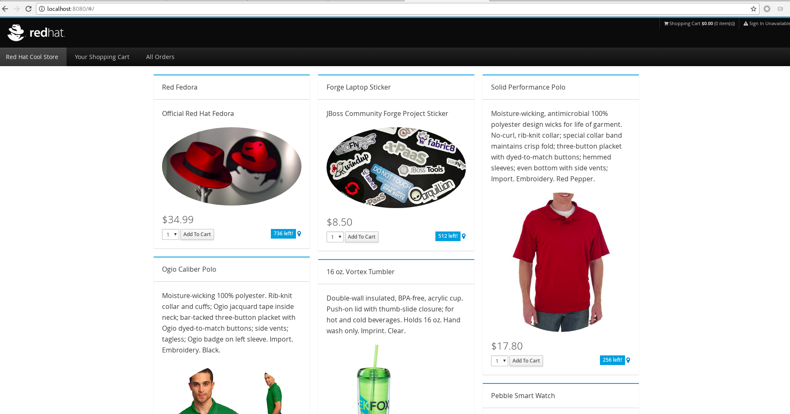
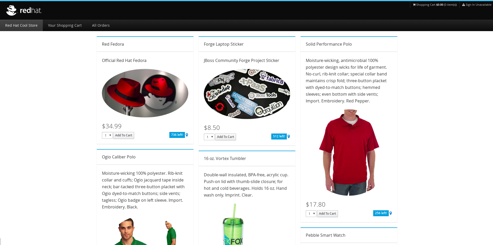

= 传统应用云原生之路
:toc: manual

== 下载相关工具包

通过 http://yum.example.com/downloads/lab2/ 可以下载本实验相关的工具包:

image:img/labs2-downloads.png[]

NOTE: 本地内容如果对 App Dev 感兴趣，且要体验传统应用云原生化，需要安装 Java，Maven 等, 具体可在上图中下载。  

== 传统应用迁移

image:img/rhamt-logo.png[]

https://developers.redhat.com/products/rhamt/overview/[Red Hat Application Migration Toolkit] https://developers.redhat.com/products/rhamt/download/[下载]：

[source, bash]
----
wget https://developers.redhat.com/download-manager/file/migrationtoolkit-rhamt-cli-4.0.1-offline.zip
----

[source, bash]
.*运行 RHAMT CLI*
----
$ ./rhamt-cli-4.0.1.Final/bin/rhamt-cli --sourceMode --input ./monolith/ --output ~/rhamt-reports/monolith --overwrite --source weblogic --target eap:7 --packages com.redhat weblogic
----

NOTE: Windows 下运行使用 `.\rhamt-cli-4.0.1.Final\bin\rhamt-cli --sourceMode --input monolith --output rhamt-reports\monolith --source weblogic --target eap:7 --packages com.redhat weblogic`。

浏览器打开 `rhamt-reports/monolith/index.html` 查看运行结果：

image:img/rhamt-reports.png[]

* 10 个必须修改的地方
* 30 个可选修改的地方
* 6  个潜在风险

问题列表：

image:img/rhamt-reports-issues.png[]

安装问题列表进行问题修复：

[source, java]
.*1 - 修改 com/redhat/coolstore/service/OrderServiceMDB.java，使内容显示如下*
----
package com.redhat.coolstore.service;

import javax.ejb.ActivationConfigProperty;
import javax.ejb.MessageDriven;
import javax.inject.Inject;
import javax.jms.JMSException;
import javax.jms.Message;
import javax.jms.MessageListener;
import javax.jms.TextMessage;

import com.redhat.coolstore.model.Order;
import com.redhat.coolstore.utils.Transformers;
import java.util.logging.Logger;
//import weblogic.i18n.logging.NonCatalogLogger;

@MessageDriven(name = "OrderServiceMDB", activationConfig = {
        @ActivationConfigProperty(propertyName = "destinationLookup", propertyValue = "topic/orders"),
        @ActivationConfigProperty(propertyName = "destinationType", propertyValue = "javax.jms.Topic"),
        @ActivationConfigProperty(propertyName = "acknowledgeMode", propertyValue = "Auto-acknowledge")})
public class OrderServiceMDB implements MessageListener {

        @Inject
        OrderService orderService;

        @Inject
        CatalogService catalogService;

        //private NonCatalogLogger log = new NonCatalogLogger(OrderServiceMDB.class.getName());

        Logger log = Logger.getLogger("MyLogger");

        @Override
        public void onMessage(Message rcvMessage) {
                TextMessage msg = null;
                try {
                                if (rcvMessage instanceof TextMessage) {
                                                msg = (TextMessage) rcvMessage;
                                                String orderStr = msg.getBody(String.class);
                                                log.info("Received order: " + orderStr);
                                                Order order = Transformers.jsonToOrder(orderStr);
                                                log.info("Order object is " + order);
                                                orderService.save(order);
                                                order.getItemList().forEach(orderItem -> {
                                                        catalogService.updateInventoryItems(orderItem.getProductId(), orderItem.getQuantity());
                                                });
                                }
                } catch (JMSException e) {
                        throw new RuntimeException(e);
                }
        }

}
----

[source, java]
.*2 - 修改 com/redhat/coolstore/service/InventoryNotificationMDB.java，使内容显示如下*
----
package com.redhat.coolstore.service;

import com.redhat.coolstore.model.Order;
import com.redhat.coolstore.utils.Transformers;

import javax.ejb.ActivationConfigProperty;
import javax.ejb.MessageDriven;
import javax.inject.Inject;
import javax.jms.JMSException;
import javax.jms.Message;
import javax.jms.MessageListener;
import javax.jms.TextMessage;
import java.util.logging.Logger;

@MessageDriven(name = "InventoryNotificationMDB", activationConfig = {
        @ActivationConfigProperty(propertyName = "destinationLookup", propertyValue = "topic/orders"),
        @ActivationConfigProperty(propertyName = "destinationType", propertyValue = "javax.jms.Topic"),
        @ActivationConfigProperty(propertyName = "transactionTimeout", propertyValue = "30"),
        @ActivationConfigProperty(propertyName = "acknowledgeMode", propertyValue = "Auto-acknowledge")})
public class InventoryNotificationMDB implements MessageListener {

    private static final int LOW_THRESHOLD = 50;

    @Inject
    private CatalogService catalogService;

    @Inject
    private Logger log;

    public void onMessage(Message rcvMessage) {
        TextMessage msg;
        {
            try {
                if (rcvMessage instanceof TextMessage) {
                    msg = (TextMessage) rcvMessage;
                    String orderStr = msg.getBody(String.class);
                    Order order = Transformers.jsonToOrder(orderStr);
                    order.getItemList().forEach(orderItem -> {
                        int old_quantity = catalogService.getCatalogItemById(orderItem.getProductId()).getInventory().getQuantity();
                        int new_quantity = old_quantity - orderItem.getQuantity();
                        if (new_quantity < LOW_THRESHOLD) {
                            log.warning("Inventory for item " + orderItem.getProductId() + " is below threshold (" + LOW_THRESHOLD + "), contact supplier!");
                        }
                    });
                }

            } catch (JMSException jmse) {
                System.err.println("An exception occurred: " + jmse.getMessage());
            }
        }
    }

}
----

[source, java]
.*3 - 修改 com/redhat/coolstore/utils/StartupListener.java，使内容显示如下*
----
package com.redhat.coolstore.utils;

import javax.annotation.PostConstruct;
import javax.annotation.PreDestroy;
import javax.ejb.Startup;
import javax.inject.Singleton;
import javax.inject.Inject;
import java.util.logging.Logger;

@Singleton
@Startup
public class StartupListener {

    @Inject
    Logger log;

    @PostConstruct
    public void postStart() {
        log.info("AppListener(postStart)");
    }

    @PreDestroy
    public void preStop() {
        log.info("AppListener(preStop)");
    }

}
----

[source, java]
.*4 - 删除 weblogic EJB Descriptors*
----
rm -f src/main/webapp/WEB-INF/weblogic-ejb-jar.xml
rm -rf src/main/java/weblogic
----

[source, java]
.*5 - 编译测试*
----
$ mvn clean install
----

== 本地测试

[source, java]
.*1 - 设定 JBoss Home*
----
unzip -d $HOME $HOME/jboss-eap-7.1.0.zip
export JBOSS_HOME=$HOME/jboss-eap-7.1
echo $JBOSS_HOME
----

[source, xml]
.*2 - 添加 Maven 插件*
----
<plugin>
    <groupId>org.wildfly.plugins</groupId>
    <artifactId>wildfly-maven-plugin</artifactId>
    <version>1.2.1.Final</version>
    <!-- TODO: Add configuration here -->
</plugin>
----

[source, xml]
.*3 - 添加基本配置*
----
<configuration>
    <jboss-home>${env.JBOSS_HOME}</jboss-home>
    <server-config>standalone-full.xml</server-config>
    <resources>
<!-- TODO: Add Datasource definition here -->
<!-- TODO: Add JMS Topic definition here -->
    </resources>
    <server-args>
        <server-arg>-Djboss.https.port=8888</server-arg>
        <server-arg>-Djboss.bind.address=0.0.0.0</server-arg>
    </server-args>
    <javaOpts>-Djava.net.preferIPv4Stack=true</javaOpts>
</configuration>
----

[source, xml]
.*4 - 添加 DS 配置*
----
<resource>
    <addIfAbsent>true</addIfAbsent>
    <address>subsystem=datasources,data-source=CoolstoreDS</address>
    <properties>
        <jndi-name>java:jboss/datasources/CoolstoreDS</jndi-name>
        <enabled>true</enabled>
        <connection-url>jdbc:h2:mem:test;DB_CLOSE_DELAY=-1</connection-url>
        <driver-class>org.h2.Driver</driver-class>
        <driver-name>h2</driver-name>
        <user-name>sa</user-name>
        <password>sa</password>
    </properties>
</resource>
----

[source, xml]
.*5 - 添加 JMS Topic 配置*
----
<resource>
    <address>subsystem=messaging-activemq,server=default,jms-topic=orders</address>
    <properties>
        <entries>!!["topic/orders"]</entries>
    </properties>
</resource>
----

[source, java]
.*6 - 部署测试*
----
$ export JBOSS_HOME=$HOME/jboss-eap-7.1 ; \ mvn wildfly:start wildfly:add-resource wildfly:shutdown
$ export JBOSS_HOME=$HOME/jboss-eap-7.1 ; mvn wildfly:run
----

通过 http://localhost:8080 访问本地部署

== 部署到 OpenShift 容器云

[source, java]
.*1 - 添加部署 OpenShift 配置*
----
<profile>
  <id>openshift</id>
  <build>
      <plugins>
          <plugin>
              <artifactId>maven-war-plugin</artifactId>
              <version>2.6</version>
              <configuration>
                  <webResources>
                      <resource>
                          <directory>${basedir}/src/main/webapp/WEB-INF</directory>
                          <filtering>true</filtering>
                          <targetPath>WEB-INF</targetPath>
                      </resource>
                  </webResources>
                  <outputDirectory>deployments</outputDirectory>
                  <warName>ROOT</warName>
              </configuration>
          </plugin>
      </plugins>
  </build>
</profile>
----

[source, java]
.*2 - 编译生成 WAR*
----
mvn clean package -Popenshift
----

[source, bash]
.*3 - 登录 OCP，创建工程*
----
$ oc login https://master.example.com:8443 -u userxx -p redhat
$ oc new-project coolstorexx --display-name='coolstore project'
----

[source, bash]
.*4 - 下载 link:files/template-binary.json[template-binary.json]，创建模版*
----
$ oc create -f template-binary.json 
template "coolstore-monolith-binary-build" created
----

[source, bash]
.*5 - 通过 template 部署 PostgreSQL 数据库和 JBoss*
----
$ oc new-app coolstore-monolith-binary-build
----

[source, bash]
.*6 - 部署 WAR 到 OpenShift 容器云*
----
$ oc start-build coolstore --from-file=deployments/ROOT.war
----

[source, bash]
.*7 - 查看运行 POC*
----
$ oc get pods
----

[source, bash]
.*8 - 查看运行服务*
----
$ oc get svc
----

[source, bash]
.*9 - 查看路由*
----
$ oc get routes
----

通过 http://www-coolstorexx.apps.example.com/ 访问如下所示

