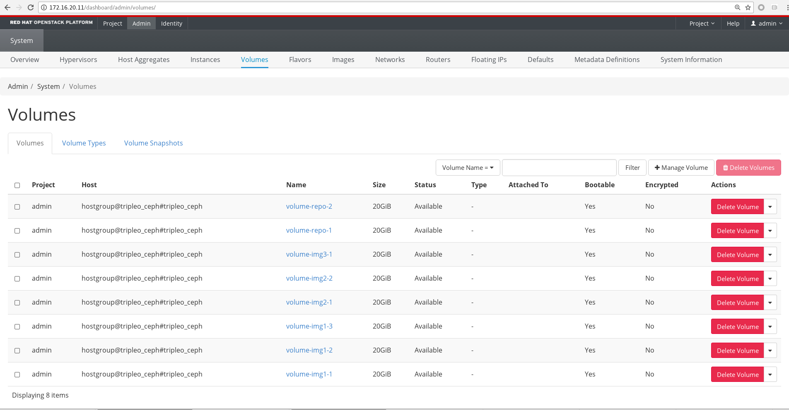
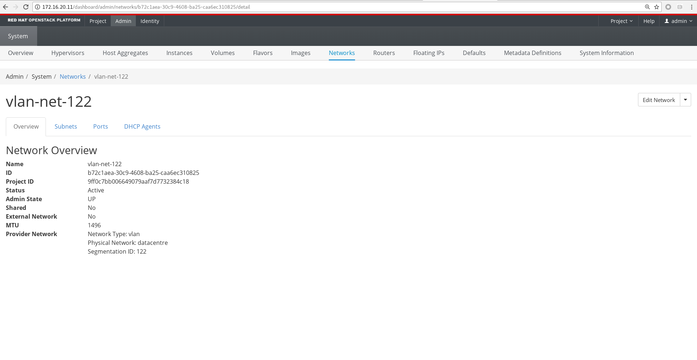
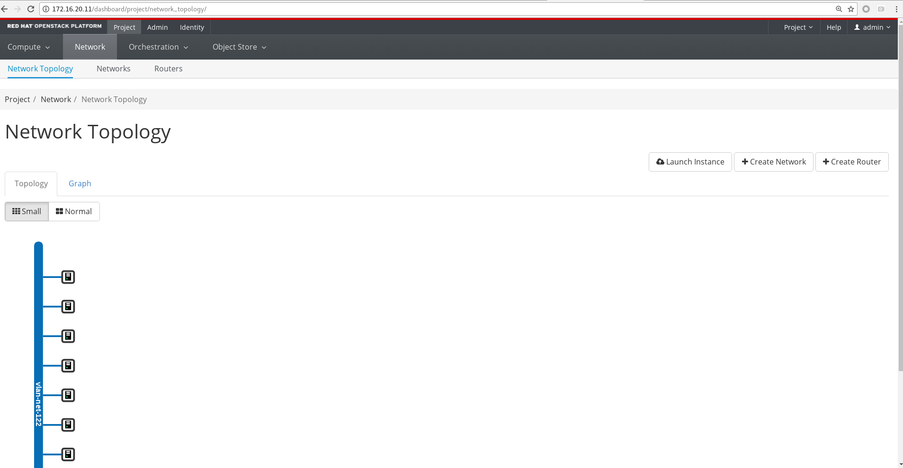

= 基本管理操作
:toc: manual

== 登录

image:img/01-osp-login.png[登录]

== Projects 列表

image:img/02-osp-projects-list.png[Projects 列表]

== 用户列表

image:img/03-osp-users.png[用户列表]

== 角色列表

image:img/04-osp-roles.png[角色列表]

== 使用情况明细

image:img/05-osp-admin-overview.png[使用情况明细]

== Hypervisor 列表

image:img/06-osp-admin-hypervisior.png[Hypervisor 列表]

== Host 列表

image:img/07-osp-admin-host-aggregates.png[Host 列表]

== Instance 列表

image:img/08-osp-admin-instances.png[Instance 列表]

== Volume 列表

== Flavor 列表

image:img/10-osp-admin-flavors.png[Flavor 列表]

== Image 列表

image:img/11-osp-admin-images.png[Image 列表]

== 网络列表

image:img/12-osp-admin-network.png[网络列表]

== 网络明细

== 网络子网

image:img/14-osp-admin-network-subnets.png[网络子网]

== 网络子网明细

image:img/15-osp-admin-network-subnets-view.png[网络子网明细]

== 网络子网列表

image:img/16-osp-admin-network-ports.png[网络子网列表]

== 网络 DHCP 代理

image:img/17-osp-admin-network-dhcp.png[网络 DHCP 代理]

== 网络路由

image:img/18-osp-admin-router.png[网络路由]

== 网络浮动 IP

image:img/19-osp-admin-floating.png[网络浮动 IP]

== Quota 明细

image:img/20-osp-admin-quota-defaults.png[Quota 明细]

== 系统概述

image:img/21-osp-admin-systems.png[系统概述]

== 计算服务

image:img/22-osp-admin-systems-computing.png[计算服务]

== 块存储服务

image:img/23-osp-admin-systems-storages.png[块存储服务]

== 网络代理

image:img/24-osp-admin-systems-networing.png[网络代理]

== 调度服务

image:img/25-osp-admin-systems-head-engine.png[调度服务]

== 计算资源明细

image:img/26-osp-admin-projects.png[计算资源明细]

== Instance 明细

image:img/27-osp-admin-projects-instances.png[Instance 明细]

== Volume 明细

image:img/28-osp-admin-projects-volumes.png[Volume 明细]

== Images 明细

image:img/29-osp-admin-projects-images.png[Images 明细]

== 安全接入

image:img/30-osp-admin-projects-seurity-access.png[安全接入]

== 网络拓扑

== 资源类型

image:img/32-osp-admin-projects-templetes.png[资源类型]

== Object Store

image:img/33-osp-admin-projects-objectsstores.png[Object Store]
