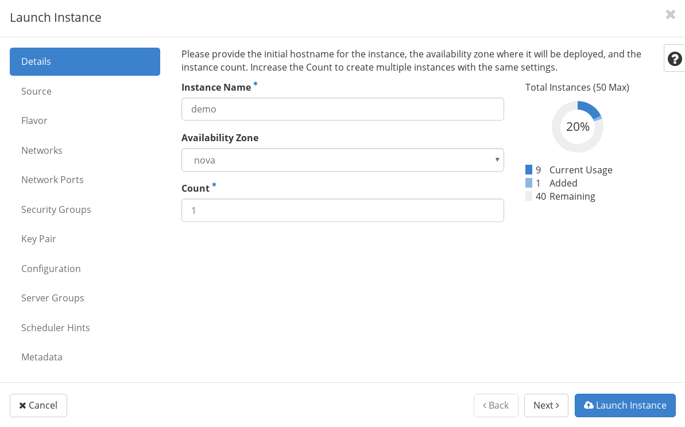
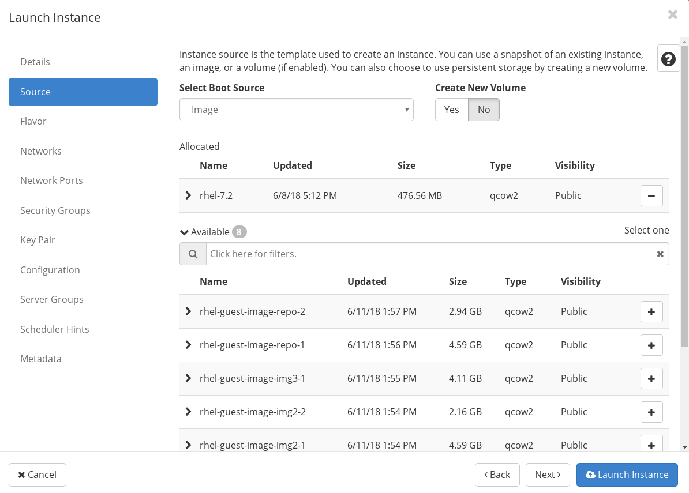
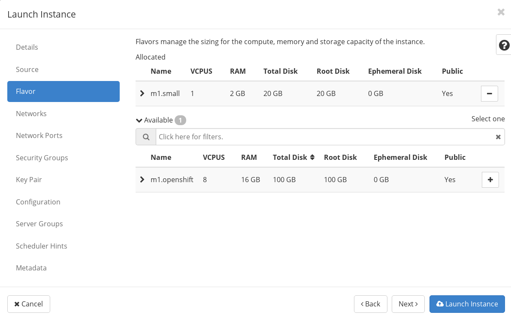

= 创建 VM 实例

* 登录 OpenStack 管理控制台，选择 `Project` -> `Instances`，在右上角点击 `Launch Instance` 按钮，进入 Launch Instance 界面，输入 Instance Name: demo，Count: 1

* 在 Launch Instance 界面选择 `Source`，在 *Select Boot Source* 下拉选项中选择 `Image`，*Create New Volume* 选择 `NO`，在可用的 Image 下拉列表中选择 rhel 7.2，点击右边加号按钮

* 同样在Launch Instance 界面选择 `Flavor`，在下拉列表中选择 `m1.openshift`

点击右下角 `Launch Instance` 按钮开始创建 VM 实例，等待 1 - 2 分钟 VM 创建会完成。

