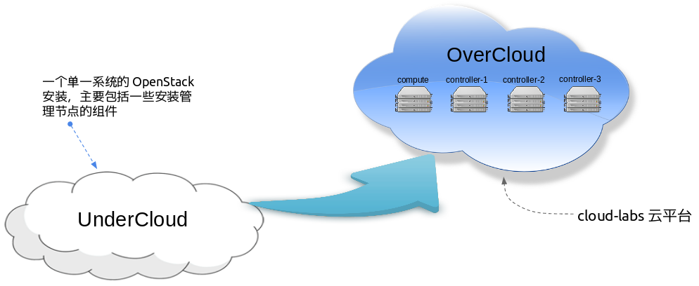
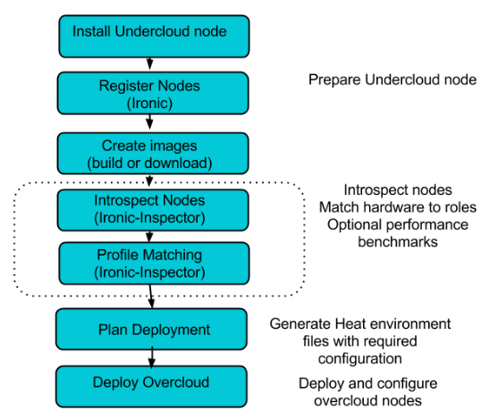
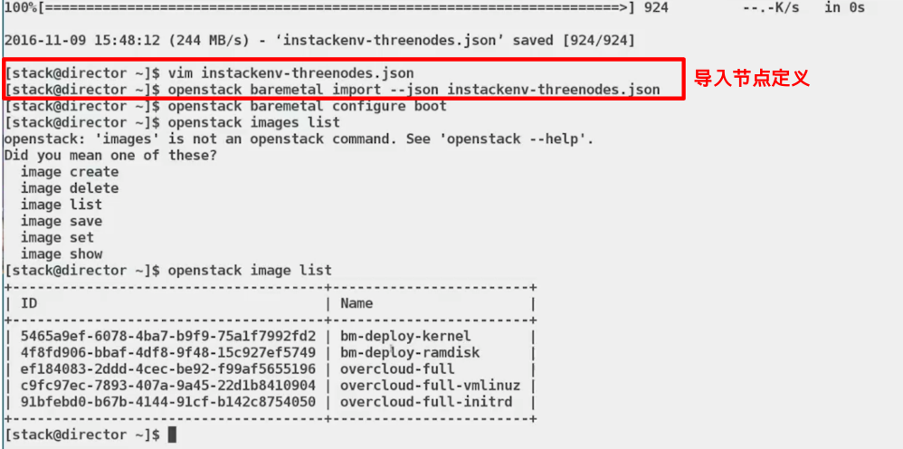
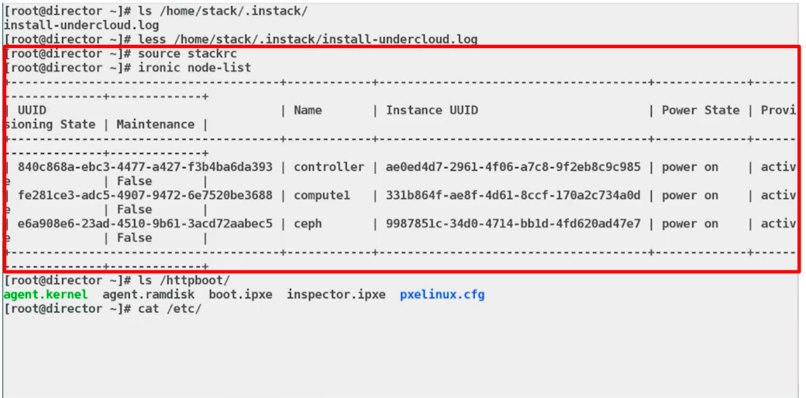
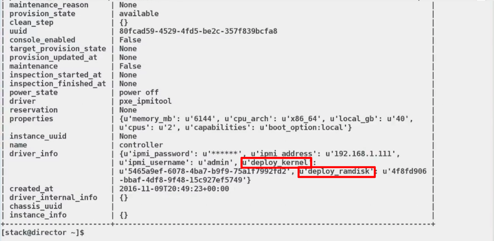
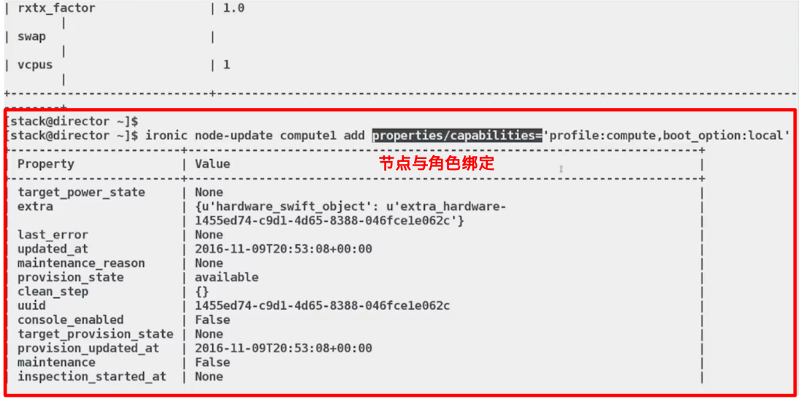

= 安装与部署
:toc: manual

== 基本概念

首先基于如下 Cloud Labs OpenStack 安装图来说明一些基本概念：

* *Undercloud* - 一个单一系统的 OpenStack 安装，主要包括一些安装管理节点的组件，主要作用是给 OverCloud 平台部署节点，添加节点、扩容、缩容等
* *OverCloud* - 一个企业级 OpenStack 平台，是通过 Undercloud 部署创建的，主要包括控制节点、计算节点、存储节点
* *TripleO* - 名字来源于 OpenStack 的安装部署是 `OpenStack on OpenStack`，它是基于 ironic 的部署工具

== ironic 工作流程

*ironic 工作流程*：

1. 安装部署节点（undercloud）
2. 节点注册，把被管理的物理节点注册到部署节点（undercloud），这个步骤与 ironic 相关
3. 准备模版
4. 收集信息，收集物理机基本信息（CPU，内存，磁盘信号、网卡型号），了解硬件信息，ironic 相关
5. 规则匹配，判断什么样的机器适合跑什么样的节点，将物理机器按照规则和相关的控制节点、计算节点、存储节点对应
6. 进一步整理模版文件，不同节点模版配置，定制化
7. 部署 - ironic 相关
 
*收集信息 & 规则匹配详细过程*

image:img/Introspection-profile-matching.png[]

1. Ironic-inspector 通知 dnsmasq 运行某一节点的 MAC 地址允许使用 DHCP，iPXE，以便物理机器通过网络启动，获取相关的信息（IP地址）
2. 获取 kernel 和 initrd - Ramdik(包括 ironic agent, 负责收集硬件信息，结果返回给Ironic-inspector)
3. Ironic-inspector 保存硬件信息给 Swift 服务
4. 将即硬件的能力同时发送给 Ironic，保存到数据库

== OpenStack 安装

如下两个视频 Step by Step 的演示 OpenStack 安装：

* https://www.youtube.com/watch?v=ulpxlNFfbF8[Installation Demonstration: Installing the Undercloud]
* https://www.youtube.com/watch?v=FF8Ks1aJ_6c[Installation Demonstration: Deploying the Overcloud]

如下是上图视频中一些截屏说明：

=== 物理节点导入

undercloud 安装完成后，向 undercloud 导入被安装节点的内容：

=== 物理节点描述

一个物理节点的描述，包括电源管理 IP 地址、电源管理用户名、电源管理口令、电源管理类型、部署网卡 MAC 地址。

image:img/osp-install-nodes-desc.png[]

=== 查看导入的物理节点

`ironic node-list` 命令可以列出所有导入的物理服务器。

=== Ironic 收集信息节点和部署阶段

Introspect 阶段:

1. 通过pxe启动主机
2. agent.kernel/agent.ramdisk
3. 执行ironic python agent收集硬件信息
4. 并将收集的硬件信息回传给服务器

image:img/osp-install-ironic-deploy-inspect.png[]

部署阶段:

1. 通过pxe启动主机
2. bm-deploy-kernel/bm-deploy-ramdisk
3. 将系统磁盘镜像写入到系统盘，拷贝vmlinuz和ramdisk并完成bootloader安装

overcloud-full:

1. overcloud-full 系统磁盘镜像
2. overcloud-full-vmlinuz 系统内核
3. overcloud-full-initrd  系统ramdisk

=== 查看节点细节

`ironic node-show controller` 可以查看节点的细节：

image:img/osp-install-node-details.png[]

部署用的 kernel 和 ramdisk 

=== 节点硬件信息

`openstack baremetal introspection bulk start` 收集节点硬件信息

image:img/osp-install-collect-nodes-info.png[]

=== 节点分类

`ironic node-update` 节点分类：

